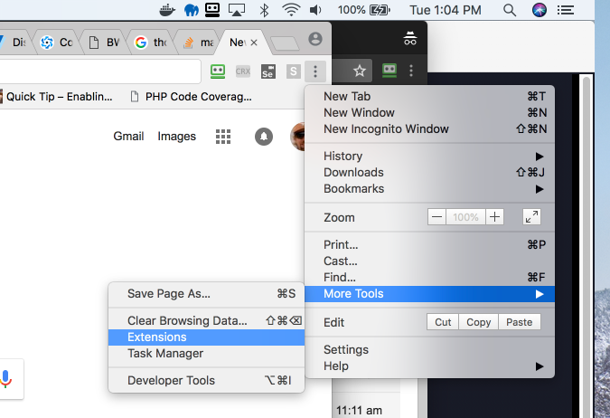
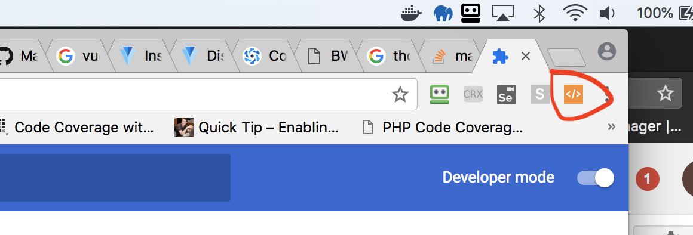
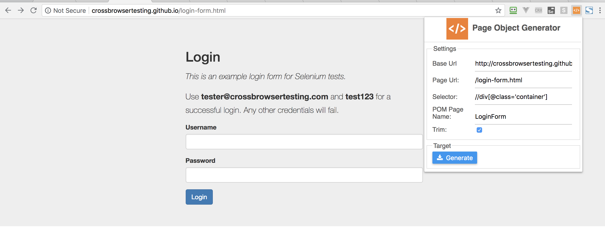
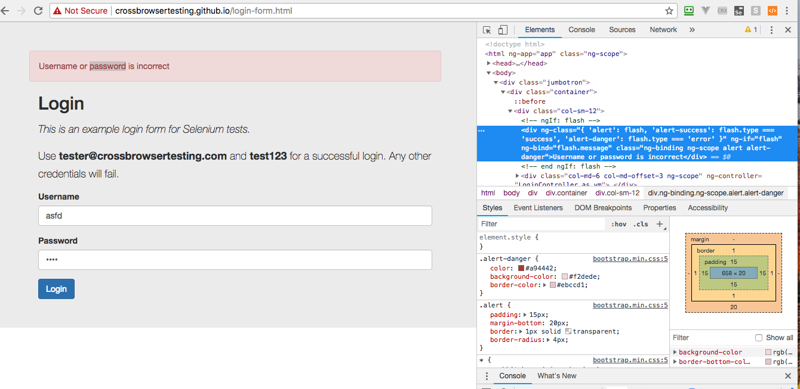
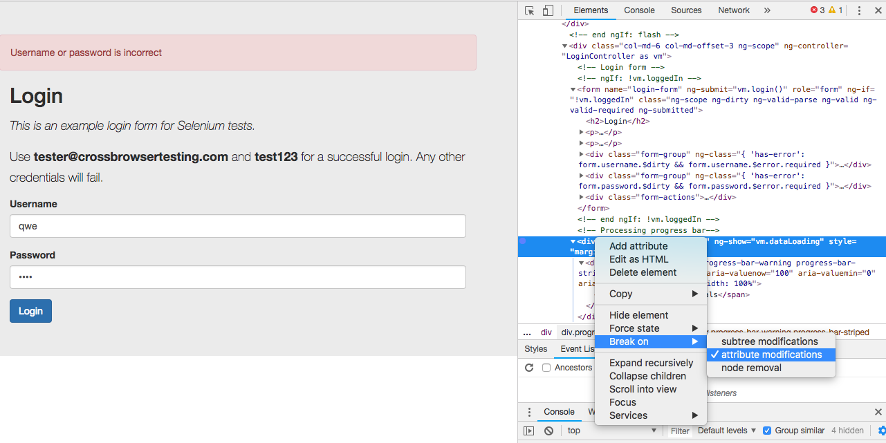
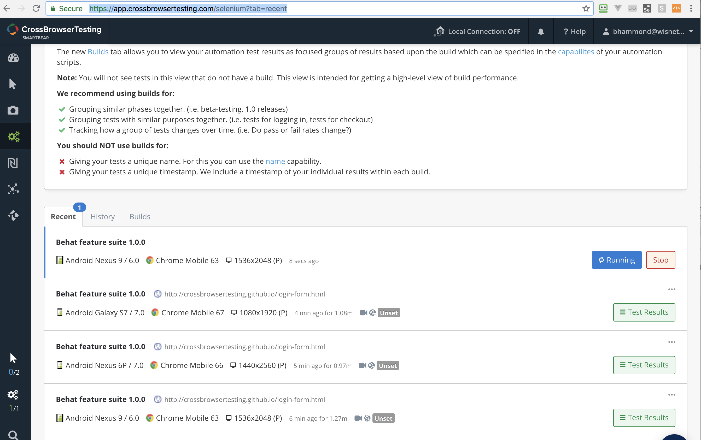
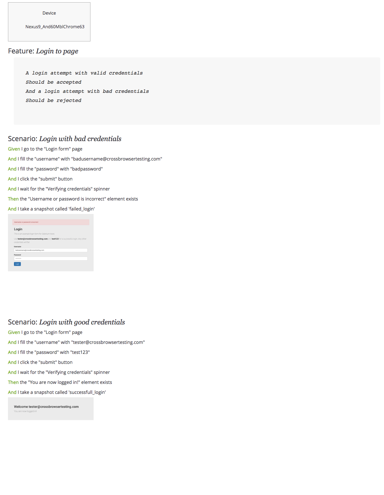
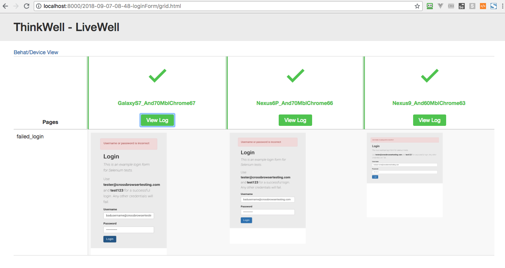
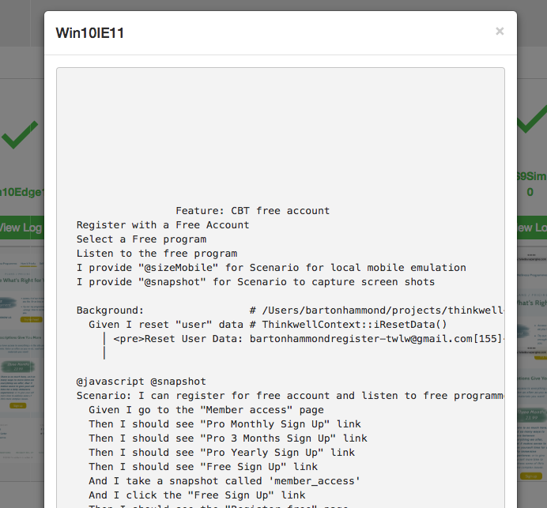

This documentation will provide steps on getting your first QaNoErr project up and running.  We will take an example website login page and some generic Gherkin scenarios.

We will do the following:
<AUTOGENERATED_TABLE_OF_CONTENTS>

### `Assumptions`
*  `git` should be installed.  See [https://git-scm.com/](https://git-scm.com/)
*  `composer` should be installed.  See [https://getcomposer.org/](https://getcomposer.org/)
*  `java` should be installed. [https://www.java.com/en/](https://www.java.com/en/)
*  To test locally with Chrome, 
   *  `chrome driver` should be installed. See [http://chromedriver.chromium.org/getting-started](http://chromedriver.chromium.org/getting-started)
   *  Chrome browser installed.  See [https://www.google.com/chrome/](https://www.google.com/chrome/)
*  For `snapshots`, `Imagemagick` should be installed. [https://www.imagemagick.org/script/index.php](https://www.imagemagick.org/script/index.php)
*  **Handlebars templates**:  See [http://handlebarsjs.com/](http://handlebarsjs.com/).  Nothing to install, but be familiar w/ the concept
*  A basic understanding of what `BDD` is about


### `Finished project`
If you want to look at the final code, you can look at this project:  foobar

### `Starting a new project from scratch`
run the following command `composer create-project bartonhammond/qanoerr POMexample -s dev`

Change into that directory: `cd POMexample`

###  `Review the composer.json file`
Copy the following to a file called `composer.json`:
```
{
    "config": {
		"bin-dir": "vendor/bin",
		"process-timeout": 0,
		"platform": {
			"php": "7.0.27"
		}
    },
    "scripts": {
		"selenium-server": "vendor/bin/selenium-server-standalone  2>&1 | tee .\/selenium-server.log",    	
		"behat-prep": "vendor/bin/preprocessGherkin",    
		"behat":  "composer behat-prep && vendor/bin/behat --config behat.yml --colors",
		"behat-cbt": "composer behat-prep && vendor/bin/buildCBTTests"
    },
    "require-dev": {
		"wisnet/behatpom": "~0.0.1"
    },
    "repositories": [
	{
	    "type": "vcs",
	    "url": "git@bitbucket.org:wisnet/behatpomchromeextension"
	}
    ],
	"autoload": {
		"classmap": [
		"features",
		"vendor"
		]
	}
}

```
The above `composer.json` defines:
*  If there are any executable files, they should be installed in the `vendor/bin`.  
*  The `process-timeout` is set to 0 so that long running processes, such as running multiple devices, doesn't time out.  
*  The `selenium-server` has it's own entry - used it with `composer selenium-server`.  When running locally, you will need this to be running in a separate terminal.
*  The `behat-prep` command will process the `features/gherkin/<name>.hbs.feature` files and produce `features/temp/<name>.feature`.  The `hbs` is for `handlebars`.  It's a templating solution that helps keep the Gherkin files from having duplicate steps.
*  The `behat` command will first prep the features and then run them with the default `behat.yml`
*  The `behat-cbt` command also does the prep of the features but then starts running against the `CrossBrowserTesting.com` site using the devices defined in `features/cbt/devices.json`.
*  The `autoload` includes the `features` directory as that is where the `context` and `pages` classes are located.

###  `Other starter files`
*  `behat.yml` - This file runs against a local browser
*  `features` - Directory to hold numerous directories
   *  `bootstrap` - Where the Project Context is located
       *  `pages` - Where the QANoErr Chrome Extension puts the POM classes
   *  `cbt` - Files for running on *Cross Browser Testing* (CBT)
   *  `gherkin` - Location for Feature hbs files
   *  `results` - Directory for results from running on CBT
   *  `temp` - Directory where the processed  Gherkin hbs files are written 

###  `Install QaNoErr Chrome extension`
We are going to install the `chrome extension` as an unpacked extension rather then load it from the Chrome store.  The reason for this is we want to expose the implementation so that you can modify the templates to meet your requirements.  That is achieved much easier if you understand how to load the extension as `unpacked`.

*  First navigate within Chrome to the Extensions site as shown here: 

*  Then click the `Load Unpacked` button and navigate to `vendor/wisnet/behatpom/extension/chrome`.  See 

You should now see the extension icon in the top right corner: 

### `A Little bit of insight to the extension`
There are three files that may be of interest to you:

*  The first is `/vendor/wisnet/behatpom/extension/chrome/assets/js/generator.js`.  This file tries to build up all the XPath selectors for elements that we have interest in such as `input`, `button`, `a`, `img`, `checkbox`, etc.  We decided that using one type of selector, in our case the XPath, was easiest to understand and utilize.  We're sure this code could be improved upon and we welcome `pull requests`.
*  The next file is `vendor/wisnet/behatpom/extension/chrome/assets/template/php.hbs`.  This file is a template that is used by [https://github.com/wycats/handlebars.js/](https://github.com/wycats/handlebars.js/)  How this works is that we collect all the XPath locators we can and then make them available to this template.
*  The next interesting file is `vendor/wisnet/behatpom/extension/chrome/assets/js/popup.js`.  At the bottom of this file is the following `javascrip` code

```
	    var fileName = context.input.pageName + ".php";
	    $.get('assets/template/php.hbs', function (data) {
		try {
		    var template=Handlebars.compile(data);
		    var result = template(context);
		    downloadFile(elements.downloader, fileName, result);
		} catch(e) {
		    debugger;
		}
	    });
```		
*  What is happening is all the XPath locators are in the object `context`.  We get the `php.hbs` template and compile it.  Then the `template` operates on the `context` and produces the `result`.  This `result` is then downloaded to the `fileName` that was provided. 


### `Generate the POM`
When we first started to learn about Automated Testing and decided that Behat was the right choice, we found this sample project from `CrossBrowserTesting`.  They provided not only some Gherkin code but also a page we could test.  So we will start with this project they provided and use QANoErr to implement the final solution.  You can see their project here: [https://github.com/crossbrowsertesting/selenium-php-behat](https://github.com/crossbrowsertesting/selenium-php-behat). 

We will be testing this page: [http://crossbrowsertesting.github.io/login-form.html](http://crossbrowsertesting.github.io/login-form.html).  Please navigate there and then click on the Extension icon and fill the form as shown: . Note that the `Base Url` field is `http://crossbrowsertesting.github.io` while the  `login-form.html` is the `Page Url`.  The `Base Url` will be defined within the `behat.yml`.

When the Extension is used, it stores its settings such as `base url`, `page url`, `selector`, `POM page name` and `trim`, so that if you come back to the same URL and use the `Extension`, the settings will be remembered.  

The `selector` is used as the containing element from which the XPath locators will be determined.  This is useful for when there is navigation on every page and you don't want to include that in every POM.

When you click the `Generate` button, save the file as `LoginForm.php` and save it to `features/bootstrap/pages`

### `Let's review the generated LoginForm.php`

```php
<?php
namespace pages;
use Wisnet\BehatPom\Utility;
use Wisnet\BehatPom\Base;

//baseUrl: http://crossbrowsertesting.github.io
//pageUrl: /login-form.html
//selector: //div[@class='container']
//trim: true
//version: 0.0.8
//date: Wed Sep 05 2018 10:56:20 GMT-0500 (Central Daylight Time)

/*
*  Extend class provides support for overriding all the functions
*/
if (file_exists('features/bootstrap/pages/LoginFormExtend.php')){
    include 'features/bootstrap/pages/LoginFormExtend.php';
}
class LoginForm extends Base {
  protected $path = "/login-form.html";
  
  protected $elements = [
  //Links
   //Textboxes
    "username" =>
    [
      "xpath" => "//*[@id='username']"
    ],
    "password" =>
    [
      "xpath" => "//*[@id='password']"
    ],
   //Selects
    //TextAreas
   //Buttons
    "submit" =>
    [
      "xpath" => "//*[@id='submit']"
    ]
   
  ];
   /*
   * Create variable if LoginForm exists
   */
    public function __construct($session, $factory, $parameters) {
        parent::__construct($session, $factory, $parameters);

        if (file_exists('features/bootstrap/pages/LoginFormExtend.php')) {
            $this->extend = new \pages\LoginFormExtend;
             $this->extend->addToElements($this);  	    
        }
    }
}
```
The first few lines are standard PHP `namespace` and `use` idioms.  The following comments contain what the values were when this class was generated.  They are there for reference in case you want to regenerate the class.  For example, maybe the UI has changed since this POM was generated.

Then we see the `file_exists` portion.  The hope of our `extension` and generated `POM` is that everything we need to interact with the page is generated.  But if there is something we need that is not generated, how do we add it?  That's where the `extend` class comes in.  The `POM` looks to see if there is a class named `<POM>Extend.php` and if so `includes` it.

Now we see the various elements that have XPath locators, namely, the `username`, `password` and `submit` button.

Note that the `LoginForm` extends `Base`.  All the action takes place in the the `FeatureContext` and the `Base`. The `FeatureContext` has the functions that the `Gherkin` interface with.  The `Base` needs to know the `elements` XPath locators and if there is a `extend` class.

### `What does the Wisnet\BehatPom\Base do?`
Let's look at a sample function within `Base`:

```
    /*
     * Click the button with $name
     */
    public function clickButton($name) {
        if (isset ($this->extend)
            &&
            method_exists($this->extend, 'clickButton')) {
            $this->extend->clickButton($this, $name);
        } else {
            $element = $this->getElement($name);
            $element->click();       
        }   
```
When a Gherkin step include `click the button` type of statement, eventually the `Base\clickButton` is called.  The base looks to see if there is an `<POM>Extend>` class.  If so, does the `<POM>Extend` class have the `clickButton` function defined?  This is a design pattern used throughout the `Base`.  It gives the developer the opportunity to override the default behaviour.  Notice if the `clickButton` is defined, then the `$this` object is passed in.

If there is no `<POM>Extend` nor `clickButton` method within it, then just call the `clickButton` on the `<POM>`.

At the bottom, if we see the `<POM>Extend.php` class exists, we instantiate it and then call the function `addToElements` so we can add additional XPath locators.  We'll see more of how this works later.

###  `Let's review our initial Gherkin`
This is the initial Gherkin that is associated with the project 

There's a few problems here that we want to address and fix.  You'll notice that the selectors are contained w/in the Gherkin. For example, the `#username` means `find an element with the id of username`.  The selector `.form-actions` means `find the element that has a class named form-actions`.

In our opinion, that is bad because we want to review the Gherkin w/ the Business folks and it shouldn't look so `geeky`.  Instead we want the Gherkin to read the way a user would speak.

Another issue with this Gherkin is there is repetition.  You can see that we go to the same page and put different values into fields and then press the same button.  It would be better if we could keep this DRY (Don't Repeat Yourself).

### `Let's review the modified Gherkin that utilizes the POM`

```gherkin
Feature: Login to page 
    A login attempt with valid credentials
    Should be accepted
    And a login attempt with bad credentials
    Should be rejected

    Scenario: Login with bad credentials
        Given I go to the "Login form" page
        And I fill the "username" with "badusername@crossbrowsertesting.com"
        And I fill the "password" with "badpassword"
        And I click the  "submit" button
        Then I should see ".alert-danger" say "Username or password is incorrect" 

    Scenario: Login with good credentials
        Given I go to the "Login form" page
        And I fill the "username" with "tester@crossbrowsertesting.com"
        And I fill the "password" with "test123"
        And I press "submit" button
        Then I should see "#logged-in-message>p" say "You are now logged in!"
```
What you should notice in the above Gherkin, we don't provide the URL for where the page is.  That information is contained in the `behat.yml` and the `LoginForm.php` class.  The `behat.yml` contains the `base url` which in our case is `http://crossbrowsertesting.github.io`.  But getting to the `login` page is known by the `LoginForm.php` class with it's `page url`. It knows what URL it was generated from.  

Note that the `LoginForm` class will be dynamically created by referencing it by name.  This is a feature of the `Page Object Model` implementation, see here: [https://behat-page-object-extension.readthedocs.io/en/stable/guide/working_with_page_objects.html#instantiating-a-page-object](https://behat-page-object-extension.readthedocs.io/en/stable/guide/working_with_page_objects.html#instantiating-a-page-object)

We can use the `username`, `password` and `submit` values because the generated `POM` has those XPath locators defined.

###  `Extend the class for the messages`
Notice that there are two messages that will display: 
1.  The failure case when the credentials are incorrect 
2.  The successful case.  Looking at the `features/bootstrap/pages/LoginForm.php`, we do not see these messages within the `$elements`.  

So we have to add them by hand.  We do this by creating a class that follows a specific naming convention of `<POM>Extend.php`.

If you look at the bottom of the `LoginForm.php` class, you'll see this constructor:

```php
   /*
   * Create variable if LoginForm exists
   */
    public function __construct($session, $factory, $parameters) {
        parent::__construct($session, $factory, $parameters);

        if (file_exists('features/bootstrap/pages/LoginFormExtend.php')) {
            $this->extend = new \pages\LoginFormExtend;
             $this->extend->addToElements($this);  	    
        }
    }

```

If a class is created that is called `LoginFormExtend.php`, then it will be instantiated and a method called `addToElements` will be called.  That method provides us the way to add more XPath locators for elements that the Chrome Extension didn't find.

So let's create the extend class called `features/bootstrap/pages/LoginFormExtend.php` and make it look like this:
```php
<?php
namespace pages;
use Wisnet\BehatPom\Utility;

class LoginFormExtend {
    public function addToElements($parent) {

    }    
}
```

Go back to the online form at [http://crossbrowsertesting.github.io/login-form.html](http://crossbrowsertesting.github.io/login-form.htmld) and put in bad credentials and click the `Login` button.  Now, inspect the message that says `Username or password is incorrect`.  Place your mouse on the message and right-click to bring up the context menu and select `Inspect`.  You should see something like this: 

Now let's figure out what the XPath would be.  Copy the value for the class on this element which should be `ng-binding ng-scope alert alert-danger`.  We can use that in our XPath selector w/ this: `$x("//div[@class='ng-binding ng-scope alert alert-danger']")`.  Click on the `Console` tab in the Chrome browser and enter that $xpath statement to confirm you get the element.

So now we have to add that to our `LoginFormExtend.php` class to now look like this:

```
<?php
namespace pages;
use Wisnet\BehatPom\Utility;

class LoginFormExtend {
    public function addToElements($parent) {
        $xpath = array("xpath" => "//div[@class='ng-binding ng-scope alert alert-danger']");
        $parent->_addToElements("Username or password is incorrect", $xpath);        
    }    
}
```

We now put in correct credentials in the Login Form and click the `Login` button to see the valid message.  The message `You are now logged in!` has an id of `logged-in`.  You can see this by inspecting on the element.  So our xpath is quite simple: `$x("//p[@id='logged-in']")`.

Let's update the LoginFormExtend to include this message.  `LoginFormExtend.php` should now look like:

```
<?php
namespace pages;
use Wisnet\BehatPom\Utility;

class LoginFormExtend {
    public function addToElements($parent) {
        $xpath = array("xpath" => "//div[@class='ng-binding ng-scope alert alert-danger']");
        $parent->_addToElements("Username or password is incorrect", $xpath);

        $xpath = array("xpath" => "//p[@id='logged-in']");
        $parent->_addToElements("You are now logged in!", $xpath);
    }    
}
```

Let's update our Gherkin code to this:
```
Feature: Login to page 
    A login attempt with valid credentials
    Should be accepted
    And a login attempt with bad credentials
    Should be rejected

    Scenario: Login with bad credentials
        Given I go to the "Login form" page
        And I fill the "username" with "badusername@crossbrowsertesting.com"
        And I fill the "password" with "badpassword"
        And I click the  "submit" button
        Then the "Username or password is incorrect" element exists

    Scenario: Login with good credentials
        Given I go to the "Login form" page
        And I fill the "username" with "tester@crossbrowsertesting.com"
        And I fill the "password" with "test123"
        And I click the "submit" button
        Then the "You are now logged in!" element exists
```

###  `Let's wait for the asynchronous call to complete`

When we clicked the `submit` button, we noticed a time delay until a message was displayed.  During that delay, we saw a orange message informing us of the action.  when you clicked the `Submit` button, a message displayed with the text "Verifying credentials".  Some folks would like to add a `And I wait "3" second` step.  That is not a good solution for waiting for some AJax call to complete.    

Let's figure out how to wait for that "spinner" to disappear.

Go back to the Chrome developers tool and open the `Elements` tab.  Scroll through the html looking for the comment that looks like `<!-- Processing progress bar-->`.  On the next element you'll see the following:

```html
<div class="progress ng-hide" ng-show="vm.dataLoading" style="margin-top:20px">

```
We want to see what happens to this `div` when we click the `Login` button.  So place your mouse over that `div` and scroll down the context menu until you find `Break on`.  Select that item and then in the submenu, click on `attribute modification`.  See 

Now, put values into the two fields (`username` and `password`) and click the `Login` button.  You will now see that you've stopped in the debugger.  What is happening is that the `class` of `ng-hide` is going to be removed from the div.  Go ahead and let the debugger continue.  After a few moments, the debugger will stop again.  This time the code is adding back in the `ng-hide` class.

You can close the developer console now.

What we want to do is wait for the `div` with only the class `progress` to disappear.  There is a step that supports this.  It will look like this in the gherkin:

```gherkin
    And I wait for the "Verifying credentials" spinner
```
It's much better to wait for events to complete then to sleep for some period of time waiting for the page to complete processing and QaNoErr provides that functionality.

So now our `loginform.hbs.feature` looks like this:

```
Feature: Login to page 
    A login attempt with valid credentials
    Should be accepted
    And a login attempt with bad credentials
    Should be rejected

    Scenario: Login with bad credentials
        Given I go to the "Login form" page
        And I fill the "username" with "badusername@crossbrowsertesting.com"
        And I fill the "password" with "badpassword"
        And I click the "submit" button
        And I wait for the "Verifying credentials" spinner
        Then the "Username or password is incorrect" element exists

    Scenario: Login with good credentials
        Given I go to the "Login form" page
        And I fill the "username" with "tester@crossbrowsertesting.com"
        And I fill the "password" with "test123"
        And I click the "submit" button
        And I wait for the "Verifying credentials" spinner
        Then the "You are now logged in!" element exists

```


###  `Replace duplicates with a snippet and also a partial`
Notice in the above Gherkin code that we are repeating the navigation to the `Login form` page, the filling of the `username` and `password` and clicking the `submit` button.  We could leave this like it is and it would work just fine.  But for teaching purposes, let's introduce a `snippet` and a `partial` and rework this Gherkin.

QaNoErr supports `partials` and `snippets`;  `Snippets` are just plain code that gets replaced within the feature;  A `partial` is similiar but also supports the passing of parameters.

Let's start w/ a `snippet` as it's the easier case.  I see this statement repeated twice: `And I wait for the "Verifying credentials" spinner`.  Let's make that into a `snippet`.  First, create a file with this naming convention: `<snippetName>.snippet.feature`; For our purpose, let's name the snippet `verify_credentials`.  So make a file called `verify_credentials.snippet.feature` win the same directory, namely `features/gherkin`;  Take the line in question and add it to that file.

So now our `verify_credentials.snippet.feature` has this content:
```gherkin
        And I wait for the "Verifying credentials" spinner
```
Now, the final step.  Back in the `loginForm.hbs.feature`, replace the line we are turning into a snippet with this:  `{{{verify_credentials}}}`.  You will do this two times.

Now are feature should look like this:
```gherkin
Feature: Login to page 
    A login attempt with valid credentials
    Should be accepted
    And a login attempt with bad credentials
    Should be rejected

    Scenario: Login with bad credentials
        Given I go to the "Login form" page
        And I fill the "username" with "badusername@crossbrowsertesting.com"
        And I fill the "password" with "badpassword"
        And I click the "submit" button
{{{verifying_credentials}}}
        Then the "Username or password is incorrect" element exists

    Scenario: Login with good credentials
        Given I go to the "Login form" page
        And I fill the "username" with "tester@crossbrowsertesting.com"
        And I fill the "password" with "test123"
        And I click the "submit" button
{{{verifying_credentials}}}
        Then the "You are now logged in!" element exists

```
Since we've updated our Gherkin, we need to run the `compose behat-prep` to generate the features.  So run that command and then look into the `features/temp` directory.  You'll see the `loginForm.feature` now has the statements replacing the `{{{verifying_credentials}}}`.  This is a quick and easy way to avoid copying Gherkin code.  This principal is sometimes referred to as DRY - Don't Repeat Yourself.

So now we want to look at creating a `partial`;  A `partial` is a `snippet` with parameters.  Here's what our `partial` will be invoked from within the `features/gherkin/loginForm.hbs.feature`

```gherkin
{{>verifying_credentials username="badusername@crossbrowsertesting.com" password="badpassword"}}
```

And here's what that `partial` will look like:
```gherkin
        Given I go to the "Login form" page
        And I fill the "username" with "{{name}}"
        And I fill the "password" with "{{password}}"
        And I click the "submit" button
```
Note that the variable `{{name}}` and `{{password}}` are passed into the partial.

So now our final Gherkin looks like this:

```gherkin
Feature: Login to page 
    A login attempt with valid credentials
    Should be accepted
    And a login attempt with bad credentials
    Should be rejected

    Scenario: Login with bad credentials
{{>verifying_credentials name="badusername@crossbrowsertesting.com" password="badpassword"}}
{{{verifying_credentials}}}
        Then the "Username or password is incorrect" element exists

    Scenario: Login with good credentials
{{>verifying_credentials name="tester@crossbrowsertesting.com" password="test123"}}
{{{verifying_credentials}}}
        Then the "You are now logged in!" element exists

```

###  `Run the tests locally`
Run tests locally means that you will be running a terminal window with the Selenium Server and another terminal runing Behat.  The Selenium server takes the requests from Behat and interfaces w/ the browser.  You will need to install the browser driver.  For `chrome`, you can download from [http://chromedriver.chromium.org/downloads](http://chromedriver.chromium.org/downloads).

Copy the `behat.yml` from `vendor/wisnet/behatpom/project-template/` to the projects base directory.  It should be like this:

```yml
default:
  suites:
    home:
      paths: ["%paths.base%/features/temp/loginForm.feature"]
      contexts: [ProjectContext]
     
  extensions:
    Behat\MinkExtension:
      browser_name: 'chrome'
      javascript_session: selenium2
      selenium2:
        wd_host: http://0.0.0.0:4444/wd/hub
      base_url: http://crossbrowsertesting.github.io

    SensioLabs\Behat\PageObjectExtension:
      namespaces:
        page: [pages]
        element: [pages]
```
Some points about the above `behat.yml` file:

*  This defines where the `feature` will be located which in our case is `"%paths.base%/features/temp/loginForm.feature"]`.  When we run `composer behat-prep`, the `*.hbs.feature` files in `features/gherkin` are processed and generated out to the `features/temp` directory.  This is where we will run our `features` from.

*  Our context is `ProjectContext` and is located in `features/bootstrap`.  

*  We will be testing w/ `chrome`.  If you want to switch to `safari` or `firefox` change the `browser_name` value. Just remember to install the appropriate driver.

*  We will utilize the `selenium2` session since we require javascript support.

*  The `selenium host` has the address of `http://0.0.0.0:4444/wd/hub`.  This is where the `selenium standalone server` will be listening for commands from Behat.

*  The base url for this test is `http://crossbrowsertesting.github.io`.  Recall that when we utilized the QaNoErr Chrome Extension to generate the Page Object Model, we identified the base url versus the `page url`.  By keeping the `page url` separate, we can change the `base url` and everything will work. For example, at wisnet, we can run our tests against a local server with this `base url`: `https://wwww.twlw.dev`.  When we push our `develop` branch, we then test w/ a different `base url`, namely `https://twlwdev.wpengine.com`.

*  The path to the POM classes are defined as `pages`

So now let's run our local test:

*  Open a terminal window and navigate to the project.
*  run the command `composer seleniumserver`.  Note this requires that Java be installed.
*  Open another terminal window and navigate to the project
*  run the command `composer behat`.  This does 2 things:
   *  First, runs `composer behat-prep` to process the `feature` files in `feature/gherkin`
   *  Second, runs `vendor/bin/behat using the local `behat.yml`

If all goes well, we should see the following output:

```
> composer behat-prep && vendor/bin/behat --config behat.yml --colors
> vendor/bin/preprocessGherkin
Feature: Login to page
    A login attempt with valid credentials
    Should be accepted
    And a login attempt with bad credentials
    Should be rejected

  Scenario: Login with bad credentials                                   # features/temp/loginForm.feature:7
    Given I go to the "Login form" page                                  # ProjectContext::iGoToThePage()
    And I fill the "username" with "badusername@crossbrowsertesting.com" # ProjectContext::iFillTheWith()
    And I fill the "password" with "badpassword"                         # ProjectContext::iFillTheWith()
    And I click the "submit" button                                      # ProjectContext::iClickTheButton()
    And I wait for the "Verifying credentials" spinner                   # ProjectContext::iWaitForTheSpinner()
    Then the "Username or password is incorrect" element exists          # ProjectContext::theElementExists()

  Scenario: Login with good credentials                             # features/temp/loginForm.feature:17
    Given I go to the "Login form" page                             # ProjectContext::iGoToThePage()
    And I fill the "username" with "tester@crossbrowsertesting.com" # ProjectContext::iFillTheWith()
    And I fill the "password" with "test123"                        # ProjectContext::iFillTheWith()
    And I click the "submit" button                                 # ProjectContext::iClickTheButton()
    And I wait for the "Verifying credentials" spinner              # ProjectContext::iWaitForTheSpinner()
    Then the "You are now logged in!" element exists                # ProjectContext::theElementExists()

2 scenarios (2 passed)
12 steps (12 passed)
0m10.52s (11.26Mb)
```

###  `Run the tests against CrossBrowserTesting`
To run against [https://crossbrowsertesting.com](https://crossbrowsertesting.com), you will need an account.  You can sign up for a free account here:  [https://crossbrowsertesting.com/freetrial](https://crossbrowsertesting.com/freetrial).  You should already have the necessary files in `features/cbt` but if not, copy the files from `vendor/wisnet/behatpom/project-template/features/cbt`

Copy the `features/cbt/cbt.env.json.example` to `features/cbt/cbt.env.json` and change the `username`, and `authkey` values.  Note we're trying to preserve the `%40` value between the `userid%40mycompany.com`.

For this test, you do not need to have the `selenium server` running because we will be using the `behat-cbt.hbs.yml` and the value of `wd_host` which the hub at `crossbrowsertesting`.  You can leave the `selenium-server` running if you like, it won't cause any issues.

The devices that we will use for this test are defined in `features/cbt`.  The file `featues/cbt/devices.json` contains the list of devices to run the test with.  If you want to see all the available devices, you can run the `features/getBrowser.sh` script after you update the CBT <userid> and <password> fields.


Let's run our test by entering the following in a new terminal window: `composer behat-cbt`.  Once the test starts, you can log into CBT and go here [https://app.crossbrowsertesting.com/selenium?tab=recent](https://app.crossbrowsertesting.com/selenium?tab=recent) to view which device is running as shown here:  

At the completion, you should see similar to the following depending upon how many devices were tested:
```
Feature: Login to page
    A login attempt with valid credentials
    Should be accepted
    And a login attempt with bad credentials
    Should be rejected

  @javascript @snapshot
  Scenario: Login with bad credentials                                   # /Users/bartonhammond/projects/POMexample/features/temp/loginForm.feature:8
    Given I go to the "Login form" page                                  # ProjectContext::iGoToThePage()
    And I fill the "username" with "badusername@crossbrowsertesting.com" # ProjectContext::iFillTheWith()
    And I fill the "password" with "badpassword"                         # ProjectContext::iFillTheWith()
    And I click the "submit" button                                      # ProjectContext::iClickTheButton()
    And I wait for the "Verifying credentials" spinner                   # ProjectContext::iWaitForTheSpinner()
    Then the "Username or password is incorrect" element exists          # ProjectContext::theElementExists()
    And I take a snapshot called 'failed_login'                          # ProjectContext::iTakeASnapshotCalled()

  Scenario: Login with good credentials                             # /Users/bartonhammond/projects/POMexample/features/temp/loginForm.feature:19
    Given I go to the "Login form" page                             # ProjectContext::iGoToThePage()
    And I fill the "username" with "tester@crossbrowsertesting.com" # ProjectContext::iFillTheWith()
    And I fill the "password" with "test123"                        # ProjectContext::iFillTheWith()
    And I click the "submit" button                                 # ProjectContext::iClickTheButton()
    And I wait for the "Verifying credentials" spinner              # ProjectContext::iWaitForTheSpinner()
    Then the "You are now logged in!" element exists                # ProjectContext::theElementExists()
    And I take a snapshot called 'successfull_login'                # ProjectContext::iTakeASnapshotCalled()

2 scenarios (2 passed)
14 steps (14 passed)
1m41.26s (12.15Mb)
Exit status : 0
```

There are also two other reports that were generated and you can find them at `features/results/YYYY-MM-DD-HH-MM-loginForm` depending on the time you run the test.  Open that directory and you'll see multiple files but the important one to start with is the `index.html`.

Using your browser, use `File->Open File` and navigate to the project and then to `features/results` and look for the latest directory.  Open the `index.html`.  This report looks like this: 

If you click into one of the devices you'll see a report that combines the actual Gherkin statements along w/ in context screenshots as shown here:  

Another very useful report is `grid.html` located in the same directory and it looks like this .  This shows all the devices that were run, in our case 3 devices.  Each device has their screenshots in that column. Each row in the table are the images for the same page.  This makes it easy for the UI folks to compare the same screen shot across multiple browsers.  

In the header row, there is going to be either a `Green` checkbox or a `Red` failure mark.  If there is a failure, you can click on the `Log` to see the logs from the run as shown here: .

If you click on any screenshot, you can see a larger version: 
